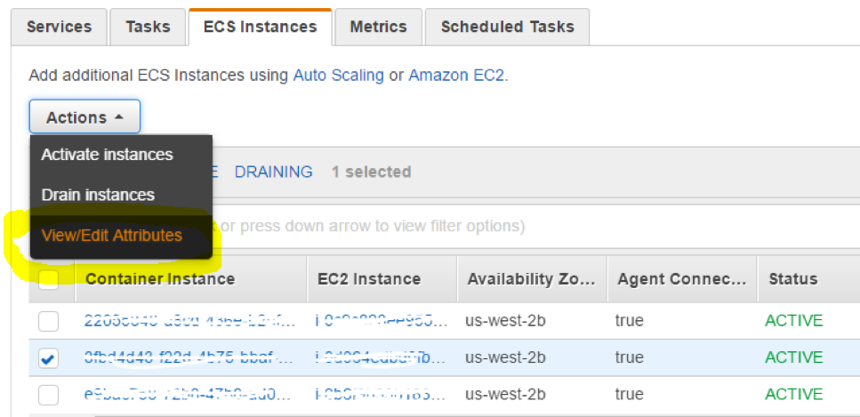
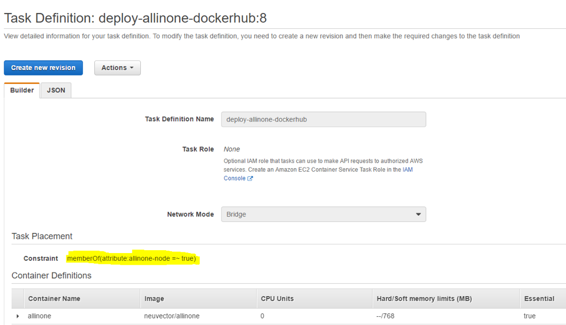

### Important: Deployment on Amazon ECS is No Longer Supported

The reference section below is not being maintained. However, it may provide some assistance in understanding how to deploy the Allinone on ECS.

### Deploy on AWS Using ECS

This is an example of how to deploy NeuVector using ECS.

:::note
Please see the Kubernetes examples for EKS.
:::

1) Prepare several Amazon ECS instances which have the Docker engine and ECS agent containers built-in. Pick one node for the management console. Then define Security Group rules that allow inbound TCP port 8443 (NeuVector’s default management console port) for access by your client browser.

2) Define a Security Group that allows TCP and UDP ports on 18300, 18301, 18400, 18401 . This is used by NeuVector enforcers to talk to the Controllers/Allinone. Apply this Security Group to all the ECS instances that will be deploying the NeuVector enforcers and controllers/allinone.

3) Set an attribute on the nodes that you want to deploy NeuVector allinone or controller container. For example, if you want to run NeuVector in a controller HA mode, the recommendation is to pick at least 3 nodes then add the attribute to all of the 3 nodes.

This is how to add attributes to your ECS instances:

Select the instance, then pick “View/Edit Attributes” from the Actions drop down menu.



Then add a new attribute. For example “allinone-node” with value “true”.


4) Create the Allinone Task Definition. Create a new Task Definition for the Allinone container. You can use the ECS interface to manually create it or paste in the sample JSON file (see below for samples). Refer to section “1. Deploying NeuVector” of these docs for how to configure the Allinone.

Enter the placement constraint. For example, if you used the attribute labeling above, then enter this in the constraint.

```json
attribute:allinone-node=~true
```



:::note
If you examine the updated JSON file now you’ll see the placement constraint added to it.
:::

5) Create a new service for the Allinone task. Set the “Placement Templates” to “One Task Per Host” so that only one Allinone/Controller can run on any host. You will also see the constraint will be used “memberOf(attribute:allinone-node=~true) which requires the node to have that attribute.


6) Now you can deploy the Allinone service. Set the “Number of tasks” to the desired Allinone/Controller number. Now the NeuVector Allinone or Controller containers will start running on the nodes selected. After the Allinone starts running you should be able to connect to the NeuVector console through HTTPS on port 8443.

7) Create the Enforcer Task Definition. This is similar to the Allinone task. Configure manually through the ECS console or use the JSON sample below.

For the Enforcer placement constraint you will require that the Enforcer must NOT be on the same node as the allinone.

```json
attribute:allinone-node!~true
```


8) Create a new service for the Enforcer task. Again, set the Task Placement to “One Task Per Host” so only one Enforcer is deployed on each host. Also note the additional constraint should show that it prevents deployment on an allinone node.


Deploy this service with desired number of enforcer nodes in “Number of tasks”. Very shortly all the enforcers will be up and running. From the NeuVector console you will be able to see all nodes being detected with enforcers.

### Sample ECS JSON Task Definitions

You can use the following samples as starting points for configuring the task definitions for the NeuVector containers.

Create a new task definition, then click Configure Via JSON at bottom. Before pasting in the json below, replace the IP address and image path (find REPLACE in samples). Typically, the IP address would be the Private IP address of the AWS Instance where the allinone will run. You can also specific a different family name than my-allinone/my-enforcer (at the bottom of json).

Sample Allinone json file:

```json
{
    "networkMode": "bridge",
    "taskRoleArn": null,
    "pidMode": "host",
    "containerDefinitions": [
        {
            "volumesFrom": [],
            "memory": null,
            "extraHosts": null,
            "dnsServers": null,
            "disableNetworking": null,
            "dnsSearchDomains": null,
            "portMappings": [
                {
                    "hostPort": 18300,
                    "containerPort": 18300,
                    "protocol": "tcp"
                },
                {
                    "hostPort": 18301,
                    "containerPort": 18301,
                    "protocol": "tcp"
                },
                {
                    "hostPort": 18400,
                    "containerPort": 18400,
                    "protocol": "tcp"
                },
                {
                    "hostPort": 18401,
                    "containerPort": 18401,
                    "protocol": "tcp"
                },
                {
                    "hostPort": 18301,
                    "containerPort": 18301,
                    "protocol": "udp"
                },
                {
                    "hostPort": 8443,
                    "containerPort": 8443,
                    "protocol": "tcp"
                },
                {
                    "hostPort": 1443,
                    "containerPort": 10443,
                    "protocol": "tcp"
                }
            ],
            "hostname": null,
            "essential": true,
            "entryPoint": null,
            "mountPoints": [
                {
                    "containerPath": "/lib/modules",
                    "sourceVolume": "modules",
                    "readOnly": null
                },
                {
                    "containerPath": "/var/run/docker.sock",
                    "sourceVolume": "dockersock",
                    "readOnly": null
                },
                {
                    "containerPath": "/host/proc",
                    "sourceVolume": "proc",
                    "readOnly": true
                },
                {
                    "containerPath": "/host/cgroup",
                    "sourceVolume": "cgroup",
                    "readOnly": true
                }
            ],
            "name": "allinone",
            "ulimits": null,
            "dockerSecurityOptions": null,
            "environment": [
                {
                    "name": "CLUSTER_JOIN_ADDR",
                    "value": "REPLACE: Private IP"
                }
            ],
            "links": null,
            "workingDirectory": null,
            "readonlyRootFilesystem": false,
            "image": "REPLACE: Image Path/Name",
            "command": null,
            "user": null,
            "dockerLabels": {
                "com.myself.name": "neuvector"
            },
            "logConfiguration": null,
            "cpu": 0,
            "privileged": true,
            "memoryReservation": 768
        }
    ],
    "volumes": [
        {
            "host": {
                "sourcePath": "/lib/modules"
            },
            "name": "modules"
        },
        {
            "host": {
                "sourcePath": "/var/run/docker.sock"
            },
            "name": "dockersock"
        },
        {
            "host": {
                "sourcePath": "/proc"
            },
            "name": "proc"
        },
        {
            "host": {
                "sourcePath": "/sys/fs/cgroup"
            },
            "name": "cgroup"
        }
    ],
    "family": "my-allinone",
    "placementConstraints": []
}
```

Sample Enforcer json file:

```json
{
    "networkMode": "bridge",
    "taskRoleArn": null,
    "pidMode": "host",
    "containerDefinitions": [
        {
            "volumesFrom": [],
            "memory": null,
            "extraHosts": null,
            "dnsServers": null,
            "disableNetworking": null,
            "dnsSearchDomains": null,
            "portMappings": [
                {
                    "hostPort": 18301,
                    "containerPort": 18301,
                    "protocol": "tcp"
                },
                {
                    "hostPort": 18401,
                    "containerPort": 18401,
                    "protocol": "tcp"
                },
                {
                    "hostPort": 18301,
                    "containerPort": 18301,
                    "protocol": "udp"
                }
            ],
            "hostname": null,
            "essential": true,
            "entryPoint": null,
            "mountPoints": [
                {
                    "containerPath": "/lib/modules",
                    "sourceVolume": "modules",
                    "readOnly": null
                },
                {
                    "containerPath": "/var/run/docker.sock",
                    "sourceVolume": "dockersock",
                    "readOnly": null
                },
                {
                    "containerPath": "/host/proc",
                    "sourceVolume": "proc",
                    "readOnly": true
                },
                {
                    "containerPath": "/host/cgroup",
                    "sourceVolume": "cgroup",
                    "readOnly": true
                }
            ],
            "name": "enforcer",
            "ulimits": null,
            "dockerSecurityOptions": null,
            "environment": [
                {
                    "name": "CLUSTER_JOIN_ADDR",
                    "value": "REPLACE: Private IP"
                }
            ],
            "links": null,
            "workingDirectory": null,
            "readonlyRootFilesystem": false,
            "image": "REPLACE: Image Path/Name",
            "command": null,
            "user": null,
            "dockerLabels": {
                "com.myself.name": "neuvector"
            },
            "logConfiguration": null,
            "cpu": 0,
            "privileged": true,
            "memoryReservation": 512
        }
    ],
    "volumes": [
        {
            "host": {
                "sourcePath": "/lib/modules"
            },
            "name": "modules"
        },
        {
            "host": {
                "sourcePath": "/var/run/docker.sock"
            },
            "name": "dockersock"
        },
        {
            "host": {
                "sourcePath": "/proc"
            },
            "name": "proc"
        },
        {
            "host": {
                "sourcePath": "/sys/fs/cgroup"
            },
            "name": "cgroup"
        }
    ],
    "family": "my-enforcer",
    "placementConstraints": []
}
```

### Live Updating NeuVector

You can do a live update of the NeuVector containers in ECS without interrupting services. NeuVector’s services can be easily updated or upgraded without interrupting any running services. To do that in Amazon ECS:

1. If you have multiple controllers or Allinones deployed as a cluster, ignore this step. If there is only a single Allinone/controller in the system, find a new ECS instance and deploy a 2nd Allinone/controller container on it (follow the NeuVector allinone/controller ECS deployment steps). After deployed, in the NeuVector management console, you will see this new controller up and running (under Resources > Controllers). This is required so that all stateful data is replicated between controllers.

2. In ECS Services, reset and delete the old Allinone/controller service. Pull the updated NeuVector images manually or trigger AWS ECS to pull new versions of Allinone/controller containers from Dockerhub or your private registry.

3. Create a new revision of the Allinone/Controller task, update the “CLUSTER_JOIN_ADDR” to the 2nd Allinone/controller’s private node IP address. 

4. Create a new service to deploy this new task (follow the same steps to deploy on ECS). After completed, the new version of the Allinone/controller should be up and running. From the NeuVector management console, all the logs and policies should still be there. Optionally, you can bring down the 2nd Allinone/Controller container now since there should be a Allinone/Controller now started on the original node.

5. From ECS Services, shutdown and update the Enforcers. Manually or auto-trigger the pulling of new Enforcer images. Then restart or update the Enforcer on all nodes. From the NeuVector console, you will see all Enforcers are up to date.

6. If you are using the separate Manager container instead of the Allinone (which already has the manager in it), simply shutdown and remove the old manager container. Then pull the new manager version, and deploy it, pointing the CLUSTER_JOIN_ADDR to the IP of the controller.

All NeuVector containers are now updated live. All policies, logs, and configurations are unaffected. The live graph view will be regenerated automatically as soon as there is new live traffic flowing between containers.
