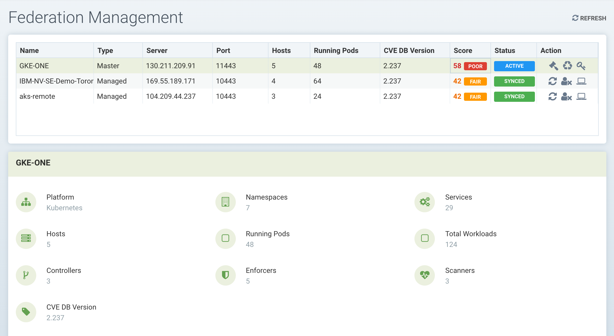
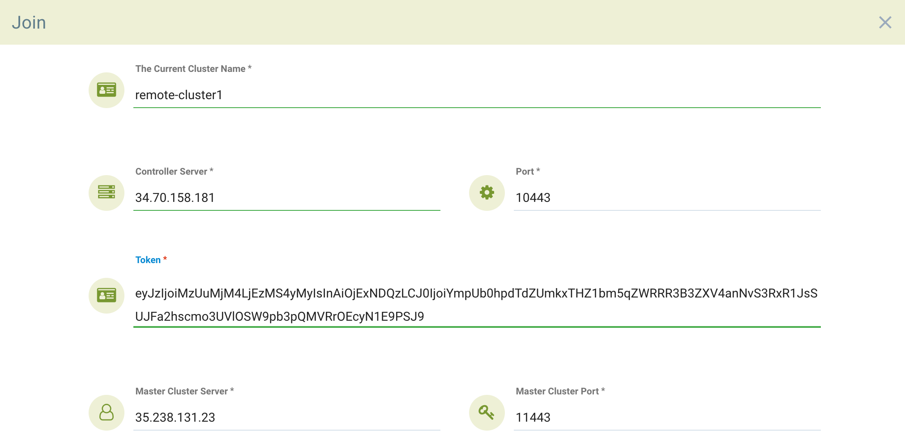
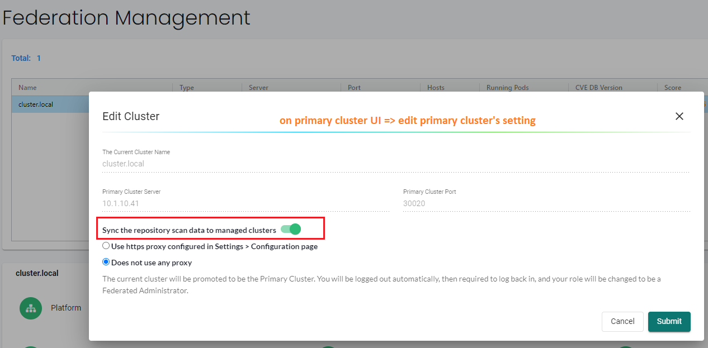

### Enterprise Console

The NeuVector console can be used to manage large enterprise multi-cluster and multi-cloud deployments. One cluster should be selected as the Primary cluster, and other Remote clusters will then be able to join the Primary. Once connected, the Primary cluster can push Federated rules down to each remote cluster, which display as Federated rules in the consoles of each remote cluster. Scanned Federated registries will also sync the scan results with remote clusters. Only local users & Rancher users who have admin permission can promote a cluster to become the primary cluster.

In addition to Federated policy, multi-cluster management supports monitoring of each remote cluster in a summary page, as shown below.



There MUST be network connectivity between the controllers in each cluster on the required ports. The controller is exposed external to its cluster by either a primary or remote service, as can be seen in the sample NeuVector deployment yaml file.

### Configuring the Primary and Remote Clusters

Log into the console for the cluster which will be the Primary cluster. In the upper right drop down menu, select Multiple Clusters and then Promote to configure the Primary. Note: Only local users & Rancher users who have admin permission can promote a cluster to become the primary cluster. Currently, SSO/LDAP/OIDC users with admin role are not allowed to promote a cluster to primary.


Enter the public IP and port of the fed-master service. You can find this by running

```shell
kubectl get svc -n neuvector
```
The output will look like:

```shell
NAME                                      TYPE           CLUSTER-IP      EXTERNAL-IP      PORT(S)                         AGE
neuvector-service-controller-fed-master   LoadBalancer   10.27.249.147   35.238.131.23    11443:31878/TCP                 17d
neuvector-service-controller-fed-worker   LoadBalancer   10.27.251.1     35.226.199.111   10443:32736/TCP                 17d
```

In the above example the primary controller host name/IP is 35.238.131.23 and the port is 11443. Note: Make sure this IP address and port are externally accessible (from the remote clusters). Note: The system clocks (time) must be the same for each primary and remote cluster in order to function properly.

After logging back into the console, select Multiple Clusters again from the upper right menu, and click on the icon to generate a token needed to connect the remote clusters. Copy the token for use in the next step. The token is valid for about 1 hour, and if expired must be generated again to connect future remote clusters.


To join a remote cluster to the primary, login to the remote cluster console as an admin. Select Multiple Clusters from the upper right drop down, and click on Join. Enter the controller IP or host name for the remote cluster as well as the port. Again, you can retrieve this information from the remote cluster by doing:

```shell
kubectl get svc -n neuvector
```
Use the output for the fed-worker of the remote cluster to configure the IP address and port. Then enter the token copied from the primary. Note that after entering the token, the IP address and port for the primary will be automatically filled in, but this can be edited or manually entered.



Log out of the remote cluster and log back into the primary. Or if already logged in, click refresh and the remote cluster will be listed in the Multiple Clusters menu.


You can click on the manage icon in the list, or use the pull down multi-cluster menu at the top to switch clusters at any time. Once you have switched to a remote cluster, all menu items on the left now apply to the remote cluster. 

### Federated Policy

Please see the Policy -> Federated Policy section for instructions on how to create Federated rules that will be pushed to each cluster.

### Federated Registries for Distributed Image Scanning Results

The primary (master) cluster can scan a registry/repo designated as a federated registry. The scan results from these registries will be synchronized to all managed (remote) clusters. This enables display of scan results in the managed cluster console as well as use of the results in admission control rules of the managed cluster. Registries only need to be scanned once instead of by each cluster, reducing CPU/memory and network bandwidth usage. 

Federated registries can only be configured by a federated admin on the primary cluster in Assets -> Registries. After adding and scanning a federated repository, the scan results will be synchronized to all managed clusters. Admission control rules in each managed cluster which require image scanning (e.g. CVE, compliance based rules) will automatically use both federated scan results as well as any registry scans results locally configured.

#### Federating Results from CI/CD Scanners (Optional)

Federated registry scan results are always sync'd to managed clusters, as described above. The primary cluster can also receive scan results [from stand alone scanner scans](/scanning/scanners#standalone-scanner-for-local-scanning) or scanner plug-ins invoked from a build CI/CD pipeline. To enable build phase (CI/CD) repository scanning results to also sync to managed clusters, first enable it by editing the primary (master) cluster settings as shown below.



