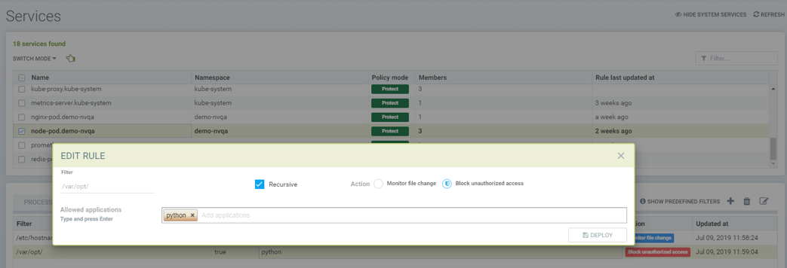
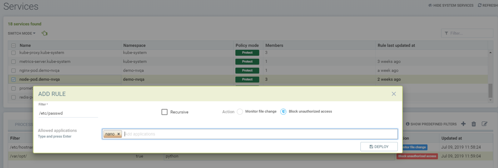
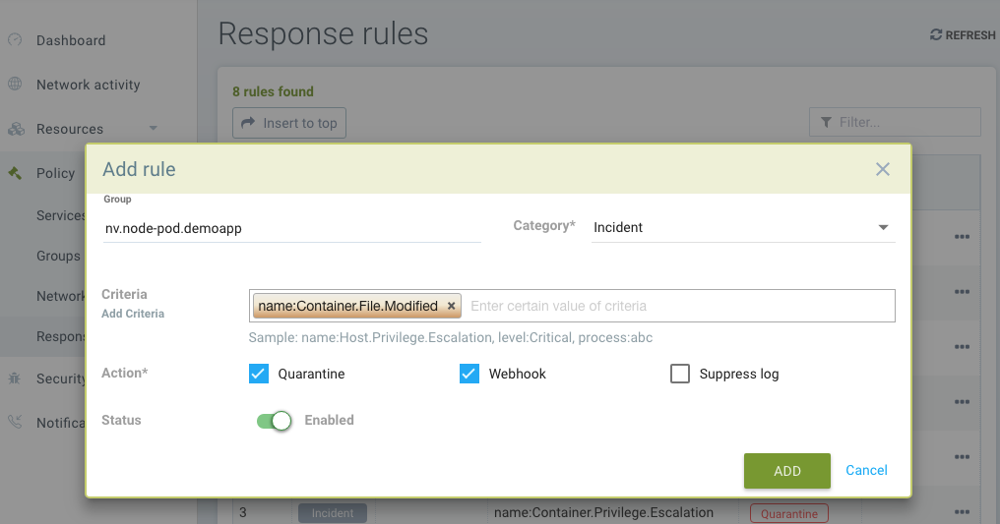

### Policy: File Access Rules

There are two types of Process/File protections in NeuVector. One is Zero-drift, where allowed process and file activity are automatically determined based on the container image, and second is a behavioral learning based. Each can be customized (rules added manually) if desired.

NeuVector has built-in detection of suspicious file system activity. Sensitive files in containers normally do not change at run-time. By modifying the content of the sensitive files, an attacker can gain unauthorized privileges, such as in the Dirty-Cow linux kernel attack, or damage the system’s integrity, for example by manipulating the /etc/hosts file. Most containers don't run in read-only mode. Any suspicious activity in containers, hosts, or the NeuVector Enforcer container itself will be detected and logged into Notifications -> Security Events.

#### Zero-drift File Protection

This is the default mode for process and file protections. Zero-drift automatically allows only processes which originate from the parent process that is in the original container image, and does not allow file updates or new files to be installed. When in Discover or Monitor mode, zero-drift will alert on any suspicious process or file activity. In Protect mode, it will block such activity. Zero-drift does not require file activity to be added to an allow-list. Disabling zero-drift for a group will cause the process and file rules listed for the group to take effect instead.

:::note
The process/file rules listed for each group are always applied, even when zero-drift is enabled. This offers a way to add allow/deny exceptions to the base zero-drift protections. Keep in mind that if a group starts in Discover mode, process/file rules can be automatically added to the list, and should be reviewed and edited before moving to Monitor/Protect modes.
:::

The ability to enable/disable zero-drift mode is in the console in Policy -> Groups. Multiple groups can be selected to toggle this setting for all selected groups.

#### Basic File Protections

If a package installation is detected, an automatic re-scan of the container or host will be triggered to detect any vulnerabilities, IF auto-scan has been enabled in Security Risks -> Vulnerabilities.

In addition to monitoring predefined files/directories, users can add custom files/directories to be monitored, and block such files/directories from being modified.

:::warning important
NeuVector alerts, and does not block modifications to predefined files/directories or in system containers such as Kubernetes ones. Blocking is only an option for user configured custom files/directories for non-system containers. This is so that regular updates of system folder or sensitive configurations are not blocked unintentionally, resulting in erratic system behavior.
:::

The following files and directories are monitored by default:

+ Executable files
+ Sensitive setuid/setgid files
+ System libraries, libc, pthread, ...
+ Package installation, Debian/Ubuntu, RedHat/CentOS, Alpine
+ Sensitive system files, /etc/passwd, /etc/hosts, /etc/resolv.conf …
+ Running processes' executable files

The following activities are monitored:

+ Files, directories, symlinks (hard link and soft link) 
+ created, deleted, modified (content change) and moved

Below is a list of the file system monitoring and what is monitored (container, host/node, and/or NeuVector enforcer container itself):

+ /bin, /usr/bin, /usr/sbin, /usr/local/bin - container, enforcer
+ Files of setuid and setgid attribute - container, host, enforcer
+ Libraries: libc, pthread, ld-linux.* - container, host, enforcer
+ Package installation: dpkg, rpm, apk - container, host, enforcer
+ /etc/hosts, /etc/passwd, /etc/resolv.conf - container, host, enforcer
+ Binaries of the running processes - container

#### Behavioral-learning based Allowed Applications in Discover Mode

When in Discover mode, NeuVector can learn and whitelist applications ONLY for specified directories or files. To enable learning, a custom rule must be created and the Action must be set to Block, as described below.

#### Creating Custom File/Directory Monitoring Rules

Custom file access rules can be created for both custom user-defined Groups as well as auto-learned Groups.

Users can add new entries for file/directory rules. 

+ Filter: Configure the file/folder to be protected (wildcards are supported)
+ Set the recursive flag (if all files in the subdirectories are to be protected)
+ Select the action, Monitor or Block (see Actions below)
+ Enter allowed applications (see Note1 below)

Actions:

+ Monitor file changes. Generate alerts (Notifications) for any changes
+ Block unauthorized access. 
    - Service in Discover mode: the file access behavior is learned (the processes/applications that access the protected file) and added to the Allowed Applications.
    - Service in Monitor mode: unexpected file behavior is alerted.
    - Service in Protect mode: unexpected access (read, modify) is blocked. New file creation in protected folders will be blocked as well.

:::note
If the rule is set to Block, and the service is in Discover mode, NeuVector will learn the applications accessing the file and add these to the Allowed Applications for the rule.
:::

:::note
Container platforms running the AUFS storage driver will not support the deny (block) action in Protect mode for creating/modifying files due to the limitations of the driver. The behavior will be the same a Monitor mode, alerting upon suspicious activity.
:::

#### File access rule order precedence

A container can inherit file access rule from multiple custom groups and user created file access rule on auto learned group.

File access rules are prioritized in the order below if the file name conflicts with predefined access rules of auto learned group and rules inheritance of multiple groups.

+ File access rule with block access (highest order)
+ File access rule with recursive enabled 
+ File access rule with recursive disable
+ User created file access rule other than predefined file access rules

#### Examples

Showing file access rule to protect /etc/hostname file of node-pod service and allow vi application to modify the file. 

Showing file access rule to protect files under /var/opt/ directory recursively for modification as well reading. The Allowed Application python can have read and modify access to these files.

Showing access rule that protects file /etc/passwd, which is one of the files covered predefined access rule in order to modify the file access action, for modification as well reading. This custom rule changes the default action of the predefined file access rule. The application Nano can have 'read and modify' access to these files. Must also add the Nano application (process) as an 'allow' rule in the process profile rule for this service to run Nano application inside the service (if it wasn't already whitelisted there), otherwise the process will be blocked by NeuVector.

Showing that the application python was learned accessing file under /var/opt directory when service mode of node-pod was in Discover. This occurs only when the rule is set to Block and the service is in Discover mode.

Showing predefined file access rules for the service node-pod.demo-nvqa. This can be viewed for this service by clicking the info icon “show predefined filters” in the right corner of the file access rule tab.

Showing a sample security event in Notifications -> Security Events, alerted as File access denial when modification of the file /etc/hostname by the application python was denied due to a custom file access rule with block action.

#### Other Responses

If other special mitigations, responses, or alerts are desired for File System Violations, a Response Rule can be created. See the example below and the section Run-Time Security Policy -> Response Rules for more details.

### Split Mode File Protections

Container Groups can have Process/File rules in a different mode than Network rules, as described [here](/policy/modes#network-service-policy-mode).
