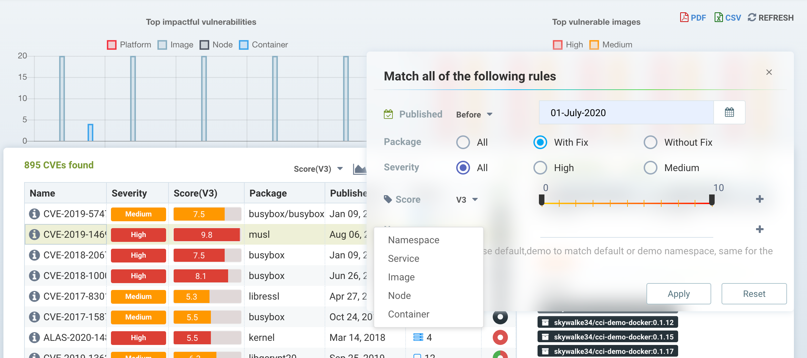
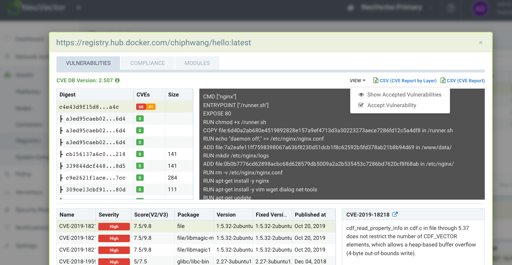
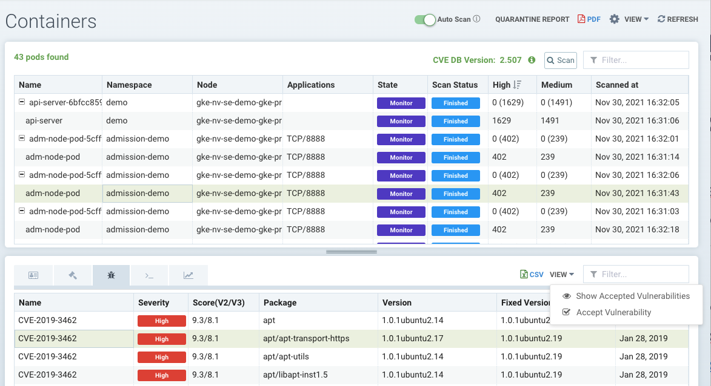

### Managing Vulnerabilities with NeuVector

NeuVector enables automated vulnerability scanning and management throughout the pipeline. Best practices for managing vulnerabilities in NeuVector include:

+ Scan during the [build-phase](/scanning/build), failing the build if there are critical vulnerabilities 'with fix available.' This forces developers to address fixable vulnerabilities before storing in registries.
+ Scan staging and production registries continuously to look for newly discovered vulnerabilities. Vulnerabilities with fixes available can be required to be fixed immediately, or a grace period allowed to provide time to remediate them.
+ Configure [Admission Control](/policy/admission) rules to block deployments into production based on criteria such as critical/high, fix available, and reported date.
+ Continuously scan the production nodes/hosts, containers, and orchestration platform for vulnerabilities for newly discovered vulnerabilities. Implement responses based on criticality/severity that can be webhook alerts (that contact security and developer), quarantine container, or start a grace period for remediation.
+ Ensure running containers are in Monitor or Protect mode with appropriate whitelist rules to 'virtually patch' vulnerabilities to prevent any exploit in production.
+ Scan distroless and PhotonOS based images.

The Dashboard in NeuVector presents a summary risk score which includes vulnerabilities, which can be used to reduce risk from vulnerabilities. See [how to improve the risk score](/navigation/improve_score) for more details.

The other main tool for reviewing, filtering, and reporting on vulnerabilities is in the Security Risks menu.

#### Security Risks Menu - Vulnerabilities

This menu combines the results from registry (image), node, and container vulnerability scans and compliance checks found in the Assets menu to enable end-to-end vulnerability management and reporting.

The Vulnerabilities menu provides a powerful explorer tool to: 

+ Make it easy to filter for viewing or downloading of reports, by typing in a search string or using the advanced filter next to the box. The advanced filter allows users to filter vulnerabilities by fix available (or not available), urgency, workloads, service, container, nodes or namespace names.
+ Understand the Impact of vulnerabilities and compliance checks by clicking on the impact row and reviewing remediation and impacted images, nodes, or containers.
+ View the Protection Status (exploit risk) of any vulnerability or compliance issue to see if there are NeuVector Run-Time security protections (rules) enabled for impacted nodes or containers.
+ 'Accept' a vulnerability/CVE after it has been reviewed to hide it from views and suppress it from reports.

Use the filter box to enter a string match, or use the advanced filter next to it to select more specific criteria, as shown below. Downloaded PDF and CSV reports will show only the filtered results.

Selecting any CVE listed provides additional details about the CVE, remediation, and which images, nodes, or containers are Impacted. The Protection State icon (circle) shows various colors to indicate a rough percentage of the impacted items which are unprotected by NeuVector during run-time, protected by NeuVector rules (in a Monitor or Protect mode), or unaffected in run-time (e.g. an image scanned with this vulnerability has no running containers). The Protection State column color scheme is:

+ Black = unaffected
+ Green = protected by NeuVector with Monitor or Protect mode
+ Red = unprotected by NeuVector, still in Discover mode

The Impact analysis window (showing affected images, nodes, containers) color scheme is:

+ Black = unaffected. There are no containers using this image in production
+ Purple = running in Monitor mode in production
+ Dark Green = running in Protect mode in production
+ Light Blue = running in Discover mode in production (unprotected)

The Impact colors are meant to correspond to the run-time protection colors for Discover, Monitor and Protect modes in other places in the NeuVector console.

#### Accepting Vulnerabilities 

You can 'Accept' a vulnerability (CVE) to exclude it from reports, views, risk scoring etc. A vulnerability can be selected and the Accept button clicked from several screens such as Security Risks -> Vulnerabilities, Assets -> Containers etc. Once accepted, it is added to the Security Risks -> Vulnerability Profile list. It can be viewed, exported, and edited here. Note that this Accept feature can be limited to listed Images and/or Namespaces. New entries can also be added manually to this list from this screen.

To Accept a vulnerability globally, go to the Security Risks -> Vulnerabilities page and select the vulnerability, then Accept. This will create a Vulnerability Profile for this CVE globally.

To Accept a vulnerability found in an image scan, open the image scan results in Assets -> Registries, pull down the View dropdown and select Accept. Note that you can also choose to Show or Hide accepted vulnerabilities for this image. NOTE: This action will create a Vulnerability Profile entry for this CVE in this IMAGE only.

To Accept a vulnerability found in a container in Assets -> Containers, select the vulnerability and pull down the View dropdown and select Accept. Note that you can also choose to Show or Hide accepted vulnerabilities for this container. NOTE: This action will create a Vulnerability Profile for this CVE in this NAMESPACE only.

This action can also be performed in Assets -> Nodes, which will create a Vulnerability Profile for the CVE for all containers, images and namespaces.

:::warning important
Globally Accepted vulnerabilities are excluded from the view in Security Risks -> Vulnerabilities and in exported reports from this page. Accepted vulnerabilities which are limited to specific images or namespaces will continue to show in the view, but be excluded for reports where the Advanced Filter limits the view to those images or namespaces.
:::

#### Managing Vulnerability Profiles

Each accepted vulnerability/CVE creates an entry in the Security Risks -> Vulnerability Profile list. These entries can be edited to add or remove attributes such as image name(s) and namespace(s).

New accepted vulnerabilities can also be added here by entering the CVE name to be Accepted.
