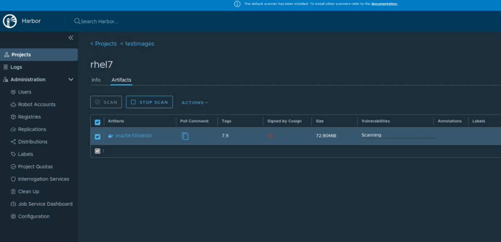

### Scanning Harbor Registries Using the Pluggable Scanner

NeuVector supports invoking the NeuVector scanner from Harbor registries through the [pluggable scanner](https://github.com/goharbor/pluggable-scanner-spec) interface. This requires configuration of the connection to the controller (exposed API). The Harbor adapter calls controller endpoint to trigger a scan, which can scan automatically on push. Interrogation services can be used for periodic scans. Scan results from Federation Primary controllers ARE propagated to remote clusters.  

:::note
There is an issue with the HTTPS based adapter endpoint error: please ignore Test Connection error, it does work even though an error is shown (skip certificate validation).
:::

#### Deploying the NeuVector Registry Adapter

The 5.2 Helm chart contains options to deploy the [registry adapter](https://github.com/neuvector/neuvector-helm/blob/master/charts/core/templates/registry-adapter.yaml) for Harbor. It can also be pulled manually from the neuvector/registry-adapter repo on Docker Hub. Options also include setting the Harbor registry request protocol and the basic authentication secret name.

After deployment of the adapter, it is necessary to configure this in Harbor.


The adapter endpoint must be entered, and the adapter connects to the controller, which is typically exposed as a service externally so the adapter can connect to it. In addition, authentication credentials for a valid NeuVector user must be entered.

#### Scanning Images from a Harbor Registry

After successful deployment and connection to a controller, an image scan can be manually or automatically triggered from Harbor. 



Periodic scans (scheduled) can be configured through Interrogation Services in Harbor, to make sure the latest CVE database is used to rescan images in registries.


Scan results can be viewed directly in Harbor.


#### Sample Deployment Yaml

Below is an example yaml:

```yaml
apiVersion: apps/v1
kind: Deployment
metadata:
  name: neuvector-scanner-pod
  namespace: neuvector
spec:
  strategy:
    type: RollingUpdate
    rollingUpdate:
      maxSurge: 1
      maxUnavailable: 0
  replicas: 1
  selector:
    matchLabels:
      app: neuvector-scanner-pod
  template:
    metadata:
      labels:
        app: neuvector-scanner-pod
    spec:
      imagePullSecrets:
        - name: regsecret
      containers:
        - name: neuvector-scanner-pod
          image: neuvector/scanner:latest
          imagePullPolicy: Always
          env:
            - name: CLUSTER_JOIN_ADDR
              value: neuvector-svc-controller.neuvector
      restartPolicy: Always
      hostAliases:
      - ip: "10.1.5.106"
        hostnames:
        - "harbor270.com"

---

apiVersion: v1
kind: Service
metadata:
  name: neuvector-service-registry-adapter
  namespace: neuvector
spec:
  ports:
  - port: 9443 #https
  #- port: 8090 #http
    nodePort: 32000
    name: registry-adapter
    protocol: TCP
  type: LoadBalancer
  selector:
    app: neuvector-registry-adapter-pod

---

apiVersion: apps/v1
kind: Deployment
metadata:
  name: neuvector-registry-adapter-pod
  namespace: neuvector
spec:
  selector:
    matchLabels:
      app: neuvector-registry-adapter-pod
  replicas: 1
  template:
    metadata:
      labels:
        app: neuvector-registry-adapter-pod
    spec:
      serviceAccount: basic
      serviceAccountName: basic
      imagePullSecrets:
        - name: regsecret
      containers:
        - name: neuvector-registry-adapter-pod
          image: neuvector/registry-adapter:latest
          imagePullPolicy: Always
          env:
            - name: CLUSTER_JOIN_ADDR
              value: neuvector-svc-controller.neuvector
            - name: HARBOR_SERVER_PROTO
              value: https       #Need to mod. http/https
            - name: HARBOR_BASIC_AUTH_USERNAME
              valueFrom:
                secretKeyRef:
                  name: neuvector-registry-adapter
                  key: username
            - name: HARBOR_BASIC_AUTH_PASSWORD
              valueFrom:
                secretKeyRef:
                  name: neuvector-registry-adapter
                  key: password
      restartPolicy: Always
```

For OpenShift 4.6+, also add the route:

```yaml
apiVersion: route.openshift.io/v1
kind: Route
metadata:
  name: neuvector-route-registry-adapter
  namespace: neuvector
spec:
  to:
    kind: Service
    name: neuvector-service-registry-adapter
  port:
    targetPort: registry-adapter
  tls:
    termination: passthrough
```
