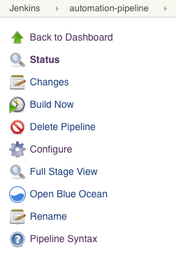
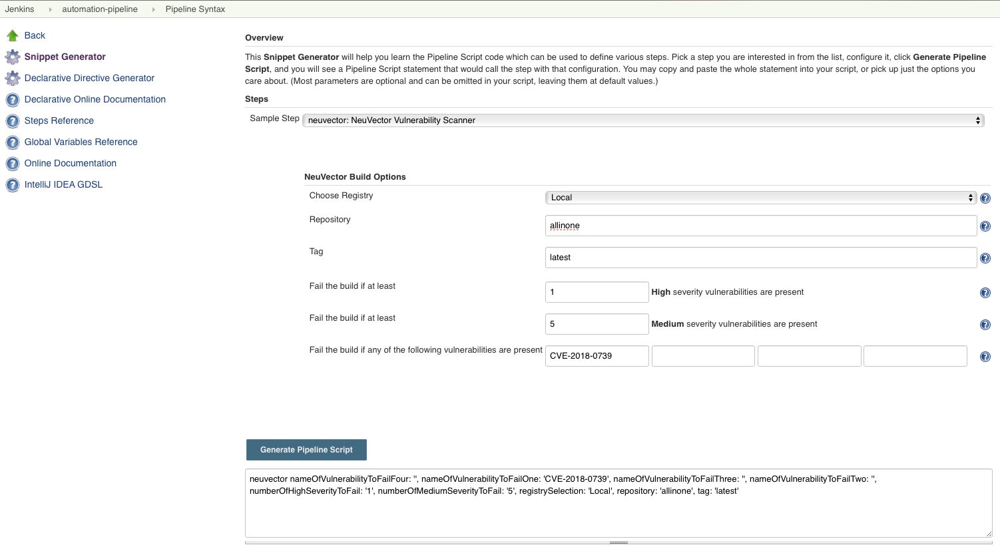
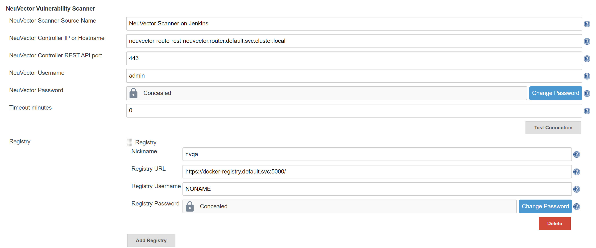

---
title: Jenkins Details
taxonomy:
    category: docs
---

### Detailed Configuration for the Jenkins Plugin

Containers provide an easy and efficient way to deploy applications. But container images may contain open source code over which you don't have a full control. Many vulnerabilities in open source projects have been reported, and you may decide to use these libraries with vulnerabilities or not after scanning the images and reviewing the vulnerability information for them.

The NeuVector Vulnerability Scanner Jenkins plugin can scan the images after your image is built in Jenkins. The plug-in source and latest documentation can be found [here](https://github.com/jenkinsci/neuvector-vulnerability-scanner-plugin) on the NeuVector GitHub page.

The plug-in supports two scan modes. The first is "Controller & Scanner" mode. The second is the standalone scanner mode. You can select the scan mode in the project configuration page. By default, it uses the "Controller & Scanner" mode.

For the "Controller & Scanner" mode, you need to deploy the NeuVector controller and scanner in the network. To scan the local image (the image on the Jenkins machine), the "Controller & Scanner" needs to be installed on the same node where the image exists.

For the standalone scanner mode, the Docker run-time must be installed on the same host with Jenkins. Also, add the jenkins user to the docker group.

```
sudo usermod -aG docker jenkins
```

#### Jenkins Plugin Installation
First, go to Jenkins in your browser to search for the NeuVector plug-in. This can be found in:

-&gt; Manage Jenkins -&gt; Manage Plugins -&gt; Available -&gt; filter -&gt; search `NeuVector Vulnerability Scanner` -&gt;

Select it and click `install without restart.'

Deploy the NeuVector Controller and Scanner container if you haven't already done so on a host reachable by the Jenkins server. This can be on the same server as Jenkins if desired. Make a note of the IP address of the host where the Controller is running. Note: The default REST API port is 10443. This port must be exposed through the Allinone or Controller through a service in Kubernetes or a port map (e.g. - 10443:10443) in the Docker run or compose file.

In addition, make sure there is a NeuVector scanner container deployed standalone and configured to connect to the Controller (if Controller is being used).

There are two scenarios for image scanning, local and registry scanning.
<ol>
 	<li><strong>Local Image Scan</strong>. If you use the plugin to scan local images (before pushing to any registries), you can scan on the same host as the controller/scanner or configure the scanner to access the docker engine on a remote host.</li>
 	<li><strong>Registry Image Scan</strong>. If you use the plugin to scan registry images (after pushing to any registries, but as part of the Jenkins build process), the NeuVector Scanner can be installed on any node in the network with connectivity between the registry, NeuVector Scanner, and Jenkins.</li>
</ol>

#### Global Configuration in Jenkins
After installing the plugin, find the ‘NeuVector Vulnerability Scanner’ section in the global configuration page (Jenkins ‘Configure System’). Enter values for the NeuVector Controller IP, port, username, and password. You may click the ‘Test Connection’ button to validate the values. It will show ‘Connection Success’ or an error message.

The timeout minutes value will terminate the build step within the time entered. The default value of 0 means no timeout will occur.

Click the ‘Add Registry’ to enter values for the registry you will use in your project. If you will be only scanning local images, you don’t need to add a registry here.

Scenario 1: global configuration example for local image scan


Scenario 2: global configuration example for registry image scan

For global registry configuration, follow the instructions above for local, then add the registry details as below.


##### Standalone Scanner

Running Jenkins scan in standalone mode is a lightweight way to scan image vulnerabilities in the pipeline. Scanner is dynamically invoked and no installaton of controller setup is required. This is especially useful when scaning an image before it is pushed to a registry. It also has no limit on how many scan tasks can run at the same time.

In order to run vulnerability scan in standalone mode, the Jenkins plugin need pull the scanner image to the host where the agent is running, so you need enter NeuVector Scanner registry URL, image repository, and the credential if needed, in NeuVector plugin configuration page.

The scan result can also be submitted to the controler and used in the admission control function. In this case, you do need a controller setup and specify how to connect to the controller in NeuVector plugin configuration page.

#### Local Configuration for scanning a remote Docker Host

<strong>Prerequisites for Local Scan on a Remote Docker Host</strong>
To enable NeuVector to scan an image that is not on the same host as the controller/allinone:
+ Make sure the docker run-time api socket is exposed via TCP
+ Add the following environment variable to the controller/allinone: SCANNER_DOCKER_URL=tcp://192.168.1.10:2376

#### Project Configuration
In your project, choose the 'NeuVector Vulnerability Scanner' plugin from the drop down menu in the 'Add build step.' Check the box "Scan with Standalone scanner" if you want to do the scan in the standalone scanner mode. By default, it uses "Controller & Scanner" mode to do the scan. 

Choose Local or a registry name which is the nickname you entered in global config. Enter the repository and image tag name to be scanned. You may choose Jenkins default environment variables for the repository or tag, e.g. $JOB_NAME, $BUILD_TAG, $BUILD_NUMBER. Enter the values for the number of high or medium, and for any name of the vulnerabilities present to fail the build.

After the build is finished, a NeuVector report will be generated. It will show the scan details and errors if any.

Scenario 1: local configuration example


Scenario 2: registry configuration example


#### Jenkins Pipeline
For the Jenkins pipeline project, you may write your own pipeline script directly, or click the ‘pipeline syntax’ to generate the script if you are new to the pipeline style task.




Select the NeuVector Vulnerability Scanner from the drop-down, configure it, and Generate the script.



Copy the script into your Jenkins task script.

Scenario 1: Simple local pipeline script example (to insert into your pipeline script):
<pre>
<code>...
  stage('Scan local image') \{
    neuvector registrySelection: 'Local', repository: 'your_username/your_image'
  \}
...</code>
</pre>

Scenario 2: Simple registry pipeline script example (to insert into your pipeline script):
<pre>
<code>...
  stage('Scan local image') \{
    neuvector registrySelection: 'your_registry', repository: 'your_username/your_image'
  \}
...</code>
</pre>


#### Additional Stages
Add your own pre- and post- image scan stages, for example in the Pipeline stage view example below.


You are now ready to start your Jenkins builds and trigger the NeuVector Vulnerability Scanner to report any vulnerabilities!

###OpenShift Route and Registry Token Example
To configure the plug-in using an OpenShift route for ingress to the controller, add the route into the controller IP field.



To use token based authentication to the OpenShift registry, use NONAME as the user and enter the token in the password.

### Special Use Case for Jenkins in the Same Kubernetes Cluster
To do build-phase scanning where the Jenkins software is running in the same Kubernetes cluster as the scanner, make sure the scanner and Jenkins are set to run on the same node. The node needs to be labeled so the Jenkins and scanner containers run on the same node because the scanner needs access to the local node's docker.sock to access the image.

