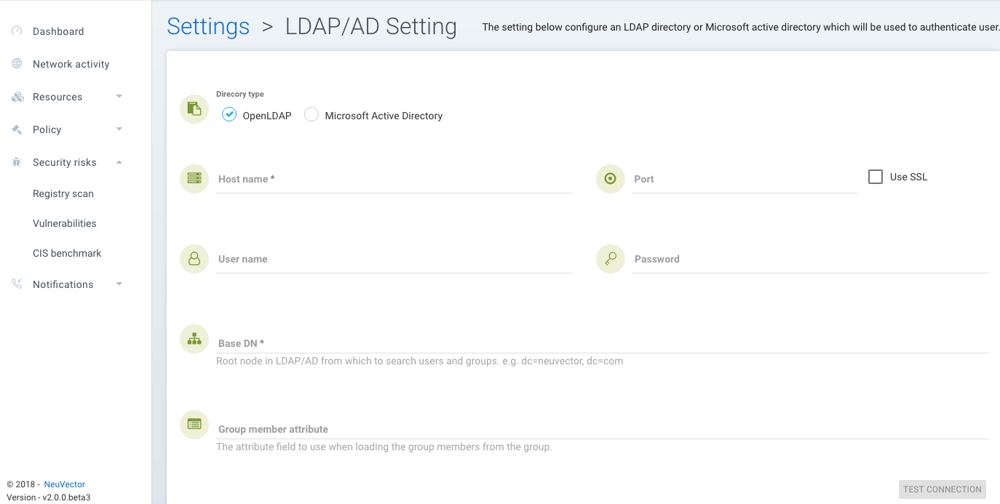

### LDAP 

Configure the required fields to connect to your LDAP server.

1. Port. The default port is 389 for SSL disabled and 636 for SSL enabled.
2. User name (optional). We use this admin user name to bind the ldap server for each query.
3. Base dn. This should be a root node in ldap server to search for the ldap user and group.
4. Default role. This is the role that a user will take if role group mapping (below) fails. If the user’s group attribute is found that can be mapped to a role, then the default role will not be used. If no matching group attribute is found, the default role will be taken. If the default role is None in this case, the user login will fail. The ‘test connection’ button will check if a username/password can be authenticated by the configured LDAP server.
5. Admin and Reader role map. This defines how to map a user’s LDAP group membership to the user role in NeuVector. Add the LDAP group list to the corresponding roles. When looking up a user’s group membership in LDAP schema, we assume the group’s member attribute is named as “memberUid”.

#### Mapping Groups to Roles and Namespaces
Please see the [Users and Roles](/configuration/users#mapping-groups-to-roles-and-namespaces) section for how to map groups to preset and custom roles as well as namespaces in NeuVector.
