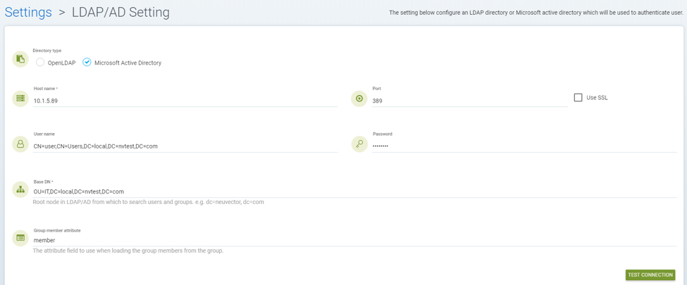

### Configuring Active Directory

This explains how NeuVector authenticates with Windows Active Directory.
The configuration page for Windows Active Directory server is shown below. 

User name: This can be any user who has read permission on the Base DN object. The dn attribute should be used as shown below, or the windows logon name such as user@local.nvtest.com.

Base DN: This is a root Windows Active Director object for user authentication. The minimum access permission requirement is read. As shown in the example above, the OU=IT,DC=local,DC=nvtest,DC=com object is only allowed for a user account which is defined in the User name field to allow a read.

With the above User name and Base DN settings, NeuVector is able to bind with Windows Active Directory successfully. Click the TEST CONNECTION to check it.

User name: It is required to use the sAMAccountName attribute ONLY to match. For example, in the screen below NeuVector is going to verify if the ituser(CN=ituser,OU=IT,DC=local,DC=nvtest,DC=com) user is able to login with NeuVector web console.

:::note
NeuVector doesn't use the values of cn, displayName, dn, givenName, name or userPrincipalName attributes etc to verify the test user.
:::

The last part is role mapping for NeuVector for the web console login.

In the example above, the defined group, _d_s_itgroup,  in the NeuVector role must have member and sAMAccountType attributes. The value of the sAMAccountType attribute MUST be 268435456 which is the Global Security group and the login username must be in the member lists.

Group member attribute: This is a member attribute for Windows Active Directory by default and it is used for the role mapping purpose, as shown above.
If all the requirements are met above, the Windows Active Directory user should be able to login to the NeuVector web console successfully.

#### Mapping Groups to Roles and Namespaces

Please see the [Users and Roles](/configuration/users#mapping-groups-to-roles-and-namespaces) section for how to map groups to preset and custom roles as well as namespaces in NeuVector.
