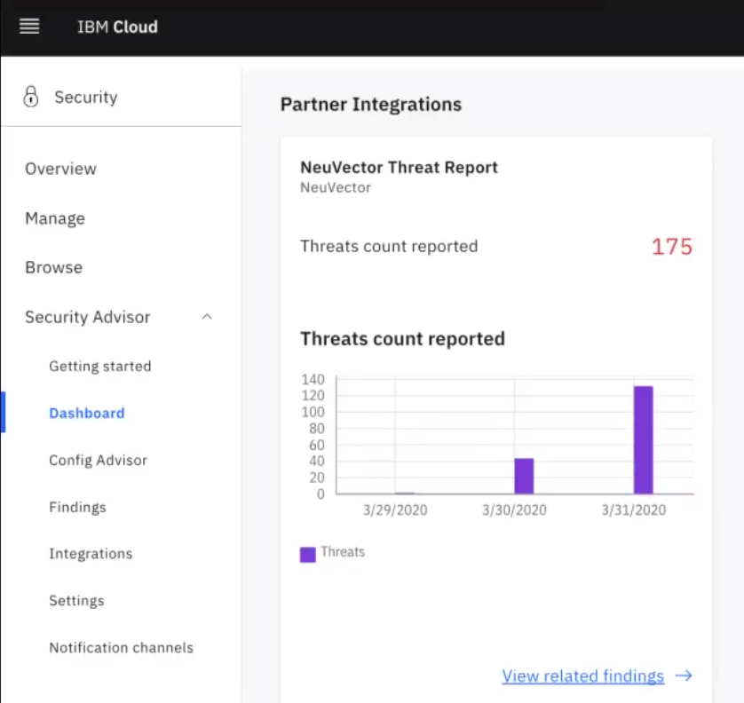

### Integrating with IBM Security Advisor

NeuVector Integrates with IBM Security Advisor on IBM Cloud.

To generate the registration URL required, please log into the NeuVector console as an administrator and go to Settings -> Configuration.

1. Enable "Integrate with IBM Security Advisor" -> Submit
2. Click "Get URL" -> Copy to clipboard

Then return to the IBM Security Advisor console, and under "Enter the NeuVector setup URL", type in https://\{NeuVector controller hostname/ip\}:\{port\} and paste what is copied in from the steps above. For the port, use the exposed NeuVector REST API port (default is 10443). For multi-cluster environments this is also the 'fed-worker' service which exposes this port.

IBM Security Advisor will communicate with your NeuVector cluster controller thru the provided hostname or IP. Note: This may need to be exposed as a service for access from outside the Kubernetes cluster, similar to how the REST API is exposed as a service.

#### Verifying the Connection

When the connection is successfully created between IBM Security Advisor & NeuVector, you will see the green "Connected at {date, time}" icon next to "Integrate with IBM Security Advisor" in the NeuVector Console.

#### Reviewing Security Events in IBM Security Advisor

A summary card with security event information is displayed.

Each security event can be investigated in more detail, as shown below:

### Removing the Integration
If you delete a NeuVector integration connection in your IBM Cloud account, remember to also disable the "IBM SA integration" for that NeuVector cluster in Settings -> Configuration.
