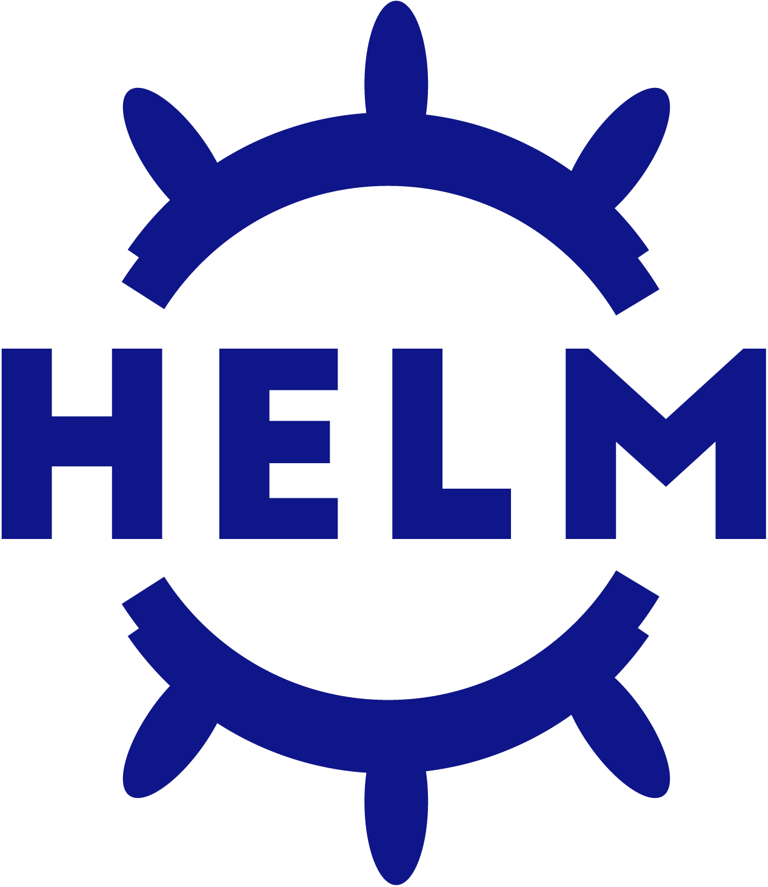

Welcome to the NeuVector Docs

Here you can access the complete documentation for NeuVector, the only Kubernetes-native container security platform.

NeuVector Images on Docker Hub

The images are on the NeuVector Docker Hub registry. Use the appropriate version tag for the manager, controller, enforcer, and leave the version as 'latest' for scanner and updater. For example:

+ neuvector/manager:5.2.0
+ neuvector/controller:5.2.0
+ neuvector/enforcer:5.2.0
+ neuvector/scanner:latest
+ neuvector/updater:latest

Please be sure to update the image references in appropriate yaml files.

If deploying with the current NeuVector Helm chart (v1.8.9+), the following changes should be made to values.yml:

+ Update the registry to docker.io
+ Update image names/tags to the appropriate version on Docker hub, as shown above
+ Leave the imagePullSecrets empty

If upgrading from NeuVector 4.x, please see these <a href="/releasenotes/5x#upgrading-from-neuvector-4x-to-5x">instructions.</a>

<table class="htmltable">	
<tr>		
	<td class="mainoptions">
		

			
		

		
			

				

					<a href="/deploying/kubernetes">Deploy on Kubernetes</a>
				
 
				
Install NeuVector via kubectl commands
 
			

		
	</td>
	<td class="mainoptions">
		

			
		

		
			

				

					<a href="https://github.com/neuvector/neuvector-helm">Deploy Using Helm Charts</a>
				
 
				
Deploy NeuVector on Kubernetes or OpenShift
 
			

		
	</td>
	<td class="mainoptions">
		

			
		

		
			

				

					<a href="/deploying/production/operators">OpenShift Operator</a>
				

				
Deploy NeuVector using Red Hat Certified or Community Operator

			

		
	</td>
</tr>
</table>

Popular Topics

<table style={{border: "none"}}>
<tr>		
	<td class="poptopic"> 
		
			

				
			

			

				

					<a href="/deploying/production">Preparing for Deployment</a>
				

				
Plan deployments including persistent data backups

			
	
		
	</td>
	<td class="poptopic"> 
		
			

				
			

			

				

					<a href="/scanning/build">CI/CD Automated Scanning</a>
				

				
Scan images as part of a CI/CD pipeline

			
	
		
	</td>
	<td class="poptopic"> 
		
			

				
			

			

				

					<a href="/policy/usingcrd">Security Policy as Code</a>
				

				
Create and manage security policy using CRDs

			
	
		
	</td>
</tr>
<tr>
	<td class="poptopic"> 
		
			

				
			

			

				

					<a href="/policy/modes">Operationalize NeuVector</a>
				

				
Move from Discovery Mode to Monitor & Protect Modes

			
	
		
	</td>
	<td class="poptopic"> 
		
			

				
			

			

				

					<a href="/scanning/scanning">Manage Vulnerabilities & Compliance</a>
				

				
End-to-End scanning & compliance reporting

			

		
	</td>
	<td class="poptopic"> 
		
			

				
			

			

				

					<a href="/configuration/users">Users and Roles</a>
				

				
Add users and customize role-based access control (RBAC)

			
	
		
	</td>	
</tr>	
<tr>
	<td class="poptopic"> 
		
			

				
			

			

				

					<a href="/policy/networkrules">Network Segmentation and Threats</a>
				

				
Using the container firewall network rules, egress controls, and threat detection

			

		
	</td>
	<td class="poptopic"> 
		
			

				
			

			

				

					<a href="/integration/integration">Enterprise Authentication & SSO</a>
				

				
LDAP, Active Directory, SAML, OpenID, Okta integration

			
	
		
	</td>
	<td class="poptopic"> 
		
			

				
			

			

				

					<a href="/automation/automation">NeuVector API Reference</a>
				

				
Automate NeuVector using the REST API

			

		
	</td>
</tr>	
</table>
