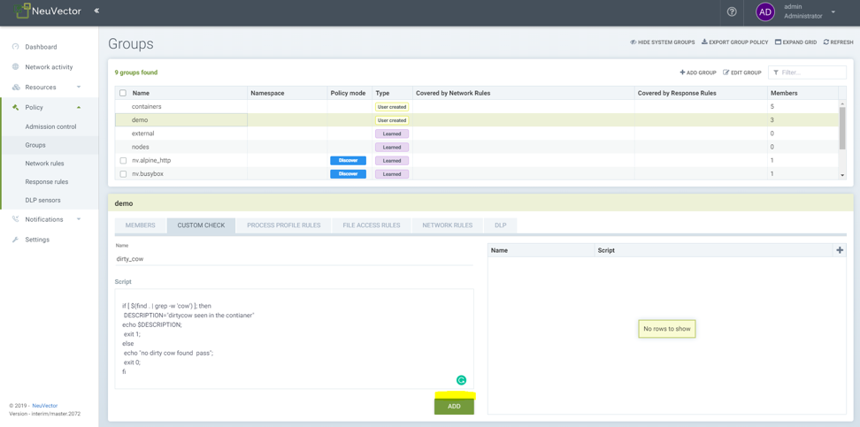
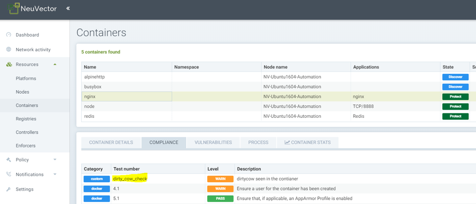
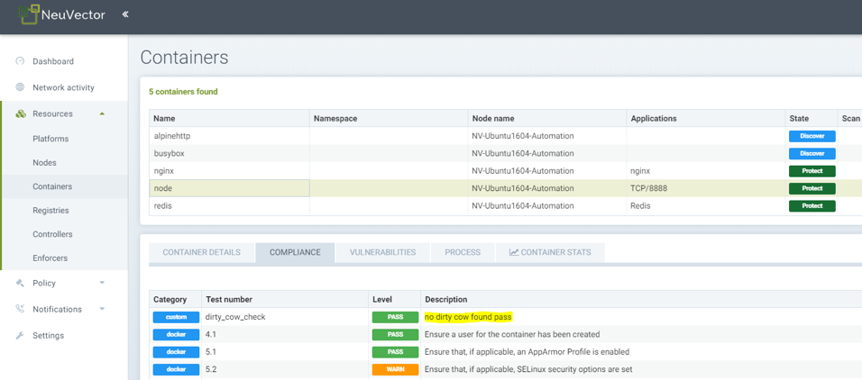
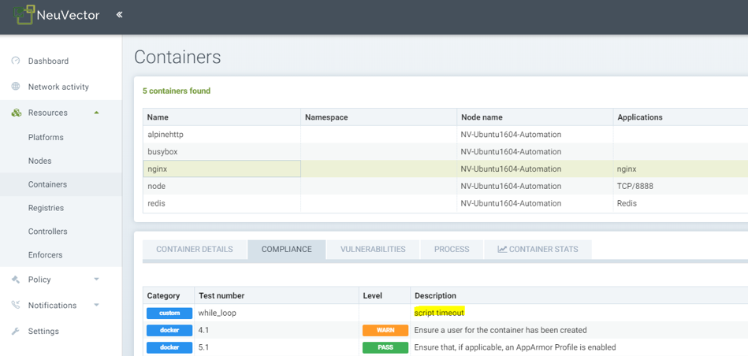
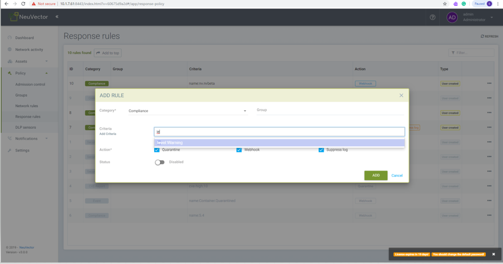
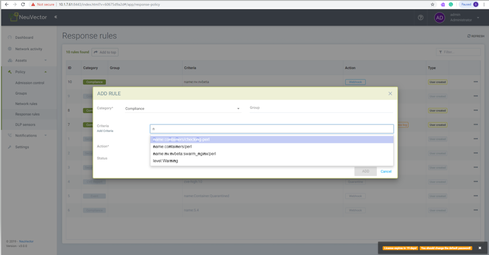

### Creating Custom Scripts for Compliance Checks

Custom scripts can be run on containers and hosts for use in compliance checks and other assessments. The Custom Compliance check is a bash script that can be run on any container to validate a condition and report result in the container or node compliance section.

:::note
The ability to create custom scripts is disabled by default to protect against misuse. This can be enabled be setting the CUSTOM_CHECK_CONTROL [environment variable](/deploying/production/details#environment-variables) in the Controller and Enforcer. Values are "disable" (default, not allowed), "strict" (admin role only), or "loose" (admin, compliance, and runtime-policy roles).
:::

:::danger caution
Custom scripts should be used with extreme caution. The custom script can run any executable in the container namespace with container privilege. Executables can be very destructive, such as rm, format, fdisk etc. This caution applies to hosts/nodes as well. Custom check scripts on hosts can be even more destructive if they can access the master node in the cluster.
:::

+ A custom script is controlled by the run-time policy permission with namespaced RBAC; users should setup the Kubernetes user roles properly.
+ Custom scripts are run with the same privilege as the running container.
+ The compliance result is removed once a custom script is deleted.
+ Custom Compliance checks need to follow a format in order to report the result correctly in the compliance report for the container or node.
    - Script starts with 'if' statement to check some condition
    - Custom check is pass if exit code is 0
    - Custom check is fail if exit code is 1

#### Sample script to check if container has root account with no password.

```bash
if [ $(cat /etc/shadow | grep  'root:::0:::::') ]; then
     DESCRIPTION="CVE-2019-5021 fails."
     echo $DESCRIPTION;
     exit 1;
else
     echo "CVE-2019-5021 pass";
     exit 0;
fi
```

#### Sample script to check dirty cow file in the container.

```bash
if [ $(find . / | grep -w 'cow') ]; then
     DESCRIPTION="dirty cow seen in the container"
    echo $DESCRIPTION;
    exit 1;
else
    echo "no dirty cow found pass";
    exit 0;
fi
```

Other Notes

+ Scripts have a timeout of 1 minute to complete, otherwise they are killed and reported as an error in the compliance result.
+ Script can be executed when in all 3-operating modes, Discover, Monitor, and Protect.

### Creating a custom check script

+ Select the service group (user created or auto learned) from Policy -> Group.
+ Click custom check tab.
+ Enter name of the script. Spaces are not allowed.
+ Copy and paste script to script section.
+ Click ADD button to add script.
+ Multiple scripts can be created and managed from the option provided in the right side corner.
+ Scripts are run on the containers covered by the service group as soon as script is created as well as when the script is updated.
+ View the script result from Assets -> Container -> Compliance, or Assets -> Nodes -> Compliance.

#### Samples

Creating a custom check script on demo group comprised of 3 containers


 
Showing compliance results for nginx container, which has a dirty cow file, so a warning is reported.  



Showing compliance result for nodejs container, which does not have a dirty cow file, so a pass is reported from the script.



Showing compliance result for nginx container for a custom check that had a timeout.
 


### Creating a response rule for compliance report 

Response rules can be created in Policy -> Response Rules that are based on results of custom compliance check results. The results are part of the category Compliance, and responses can be created for all events of a certain level.

+ Choose category compliance
+ Type service group name in group option and choose desired group from auto select option
+ Type level and choose level:Warning from auto select option
+ Enable desired actions Quarantine, webhook and/or suppress log
+ Enable status button
+ Click Add button to add the response rule

The next compliance event with result warning will trigger the corresponding response rule action.



Create a response rule for compliance report and custom check script by name:

+ Choose category compliance
+ Type service group name in the group option and choose the desired group from drop down options, or leave the group name blank to apply to all
+ Type 'n' and choose custom check script name from the drop down menu of options
+ Enable desired actions Quarantine, webhook and/or suppress log
+ Enable status button
+ Click Add button to add the response rule

The next compliance event with warning will trigger the corresponding response rule action.


