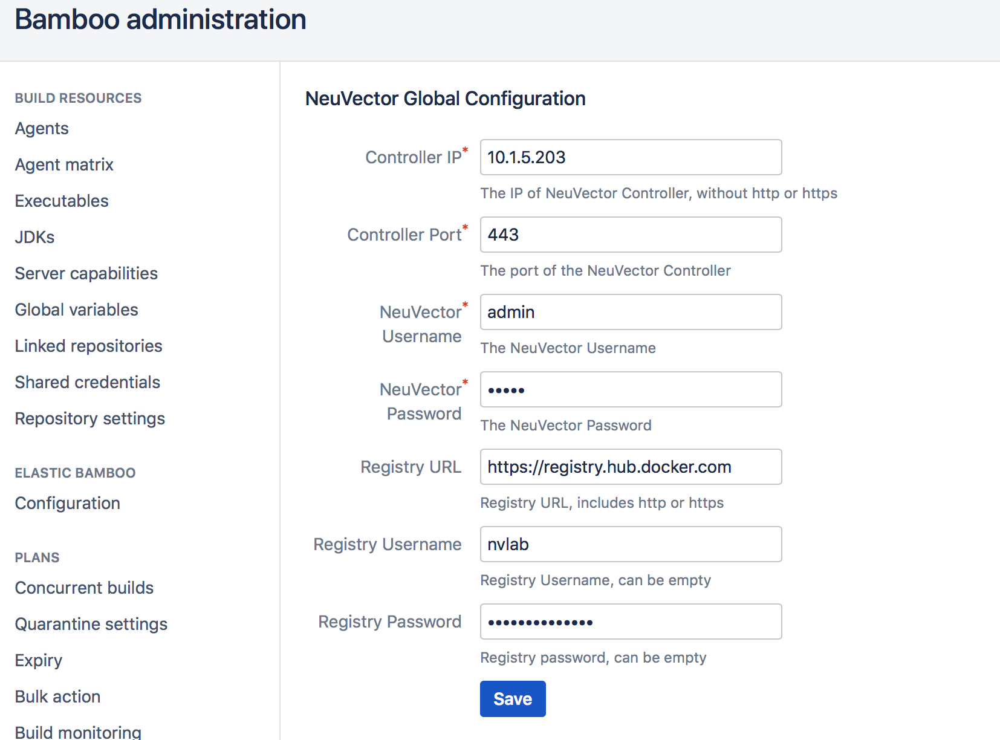
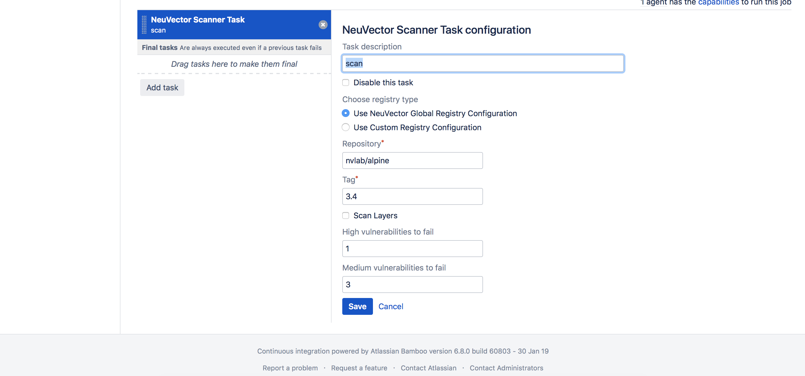
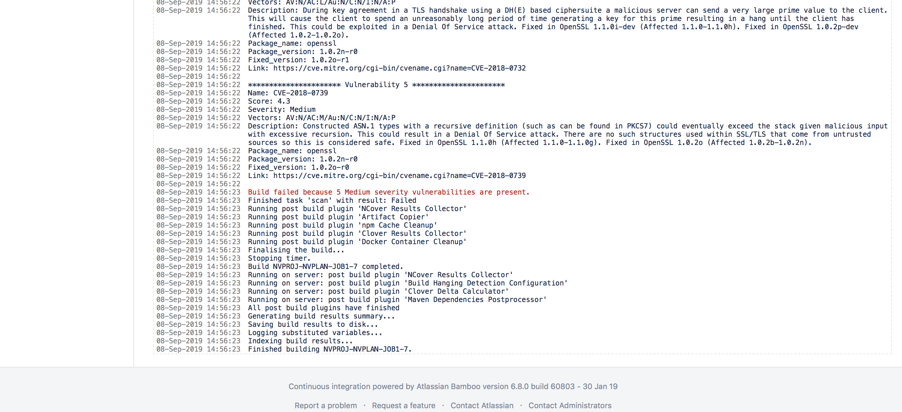

### Scan for Vulnerabilities during Bamboo Build Pipeline

The Bamboo plug-in for NeuVector can be used to scan for vulnerabilities in the Bamboo pipeline. The plug-in can be downloaded from the Admin -\> Add-ons menu in Bamboo. Use Find New Apps to search for NeuVector. The plug-in is also described in the [Atlassian Marketplace](https://marketplace.atlassian.com/apps/1221199/neuvector).

Deploy the NeuVector Allinone or Controller container if you haven't already done so on a host reachable by Bamboo. Make a note of the IP address of the host where the Allinone or Controller is running.

In addition, make sure there is a NeuVector scanner container deployed and configured to connect to the Allinone or Controller. In 4.0 and later, the neuvector/scanner container must be deployed separate from the allinone or controller.

#### Configure Global Settings

Configure settings for the NeuVector Controller/Allinone including the NeuVector authentication as well as the registry authentication.

#### Configure the Repository and Build Policy

Create a task and enter the repository and tag to scan as well as the build policy to fail the build if vulnerabilities are detected. Enable layered scanning if the results should contain an analysis of vulnerabilities for each layer in the image.

#### Review Results

Review the results in the scan logs, including the scan summary, reason for failing if appropriate, and details for each CVE detected.

